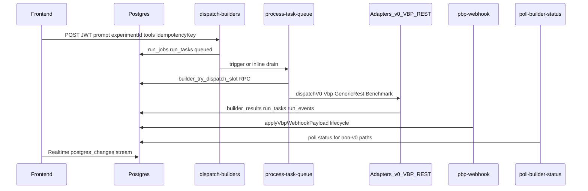

# Hardening audit — builder pipeline (v0 + POP/VBP)

**Date:** 2026-03-23  
**Scope:** full-stack (Edge Functions, DB/RPC, frontend realtime/stream, POP/VBP contracts).  
**Implementation source of truth:** [`supabase/functions/`](../supabase/functions/), [`src/hooks/`](../src/hooks/), [`docs/VBP-SPEC.md`](./VBP-SPEC.md).

**Note (audit scope):** This document is an **inventory, risk matrices, drift report, and slice plan** (A–D). **Slices A–D are implemented in the repo** (Edge, migrations, frontend stream, OpenAPI/docs/CI) — see §5 for details and file paths.

---

## 1. Flow map (inventory)

### End-to-end diagram

### Paths by integration type

| Adapter | Condition (`resolveAdapterKind`) | Implementation | Output |
|---------|----------------------------------|----------------|--------|
| `v0_live` | `toolId === "v0"` && tier 1 && enabled | [`v0-adapter.ts`](../supabase/functions/_shared/adapters/v0-adapter.ts) | v0 REST API |
| `vbp_live` | `integration_type === "vbp"`, tier ≤2, `api_base_url` | [`vbp-adapter.ts`](../supabase/functions/_shared/adapters/vbp-adapter.ts) | VBP dispatch + webhook/poll |
| `generic_rest_live` | `rest_api`, `api_base_url`, `response_id_path`, tier ≤2 | [`generic-rest-adapter.ts`](../supabase/functions/_shared/adapters/generic-rest-adapter.ts) | JSON templates |
| `benchmark` | disabled or conditions not met | [`benchmark-adapter.ts`](../supabase/functions/_shared/adapters/benchmark-adapter.ts) | Mock / benchmark |

Source: [`adapter-registry.ts`](../supabase/functions/_shared/adapter-registry.ts).

### Auth and trust boundaries

| Component | Auth | Notes |
|-----------|------|--------|
| `dispatch-builders` | User JWT + `experiments` ownership | Idempotency: `idempotency_key` per user → [`run_jobs`](./ORCHESTRATOR.md) |
| `process-task-queue` | Bearer = `SUPABASE_SERVICE_ROLE_KEY` only | `verify_jwt=false`; no user JWT |
| `pbp-webhook` | Optional HMAC when `VBP_WEBHOOK_SECRET` | Without secret — **any POST** (production risk) |
| `run-on-v0` | Anon | Guests; abuse risk |
| `poll-v0-status` | Usually anon from browser | Per `config.toml` |

### Rate limit and retry (backend)

| Mechanism | Where | Behavior |
|-----------|-------|------------|
| `builder_try_dispatch_slot` | RPC ([`20260325100000_builder_dispatch_slot_rpc.sql`](../supabase/migrations/20260325100000_builder_dispatch_slot_rpc.sql)) | `max_per_minute`, `max_concurrent` |
| Slot rejection | [`process-task-queue`](../supabase/functions/process-task-queue/index.ts) | `retrying`, `next_retry_at`, `attempt_count++`, backoff 60s / 15s |
| Circuit breaker | `builder_integration_config.circuit_state` | `retrying` + 60s, **no** fallback to benchmark |
| No max `attempt_count` | Worker | Theoretically infinite retry on rate limit |

### Stream UI → tables

| Hook / component | Realtime tables | Use |
|------------------|-----------------|-----|
| `useRunTaskStream` | `run_tasks`, `run_events`, `builder_results` | [`ComparisonCanvas`](../src/components/ComparisonCanvas.tsx) |
| `useBuilderApi.runBuilders` | `builder_results` channel + v0 polling | After `dispatch-builders` |
| `RunCenter` | `run_events` | Event feed |
| `RunsNow` | `experiments` INSERT | Live list |

---

## 2. Risk matrix — backend

| ID | Risk | Severity | Evidence / file | Mitigation (owner: backend) |
|----|--------|----------|-----------------|----------------------------|
| B1 | No `attempt_count` ceiling → potentially infinite `retrying` | **High** | [`process-task-queue/index.ts`](../supabase/functions/process-task-queue/index.ts) | Max attempts → `failed` or `dead_letter`; CHECK migration if DB lacks status |
| B2 | Frontend expects `dead_letter` in types; DB may lack it | **High** | [`useRunTaskStream.ts`](../src/hooks/useRunTaskStream.ts), `BuilderProgressStream` | Unify `run_tasks.status` enum + worker |
| B3 | Webhook without idempotency (replay / ordering) | **High** | [`vbp-webhook-apply.ts`](../supabase/functions/_shared/vbp-webhook-apply.ts) | Idempotent key `(provider_run_id, event_hash, seq)` or dedupe table |
| B4 | `VBP_WEBHOOK_SECRET` unset → no verification | **Medium** | [`pbp-webhook/index.ts`](../supabase/functions/pbp-webhook/index.ts) | Production: fail closed or warn + block |
| B5 | `pickNextQueuedOrRetrying` without `FOR UPDATE SKIP LOCKED` | **Medium** | Two parallel worker invocations | Advisory lock or atomic claim |
| B6 | Adapters: v0 has HTTP retry; VBP/generic REST — weaker | **Low** | [`v0-adapter.ts`](../supabase/functions/_shared/adapters/v0-adapter.ts) vs vbp | Unify retry on 429/5xx where sensible |
| B7 | Queue trigger with hardcoded URL (if in migration) | **Low** | Older migrations | Parameterize / document env |
| B8 | Public `run-on-v0` | **Medium** (cost) | [`config.toml`](../supabase/config.toml) | Rate limit / captcha / quota |

---

## 3. Risk matrix — frontend (stream / realtime)

| ID | Risk | Severity | Evidence | Mitigation (owner: frontend) |
|----|--------|----------|----------|------------------------------|
| F1 | Race: `loadInitialData` vs realtime may overwrite fresher events | **High** | [`useRunTaskStream.ts`](../src/hooks/useRunTaskStream.ts) L55–89 vs L105+ | Merge by `updated_at` / functional updates; or load before subscribe with cancel |
| F2 | No channel status handling (`CHANNEL_ERROR`, reconnect) | **Medium** | `.subscribe()` without callback | `subscribe((s)=>…)`, toast, reconnect |
| F3 | `run_tasks` handler only `payload.new` — DELETE does not clear state | **Medium** | L111–118 | Handle DELETE with `payload.old` |
| F4 | Two sources: `builderResults` vs `stream.results` — which is newer | **Medium** | [`ComparisonCanvas`](../src/components/ComparisonCanvas.tsx) | Merge by timestamp; single precedence |
| F5 | `setResults` calls `startV0Polling` inside updaters | **Medium** | [`useBuilderApi.ts`](../src/hooks/useBuilderApi.ts) L468+ | Move to `useEffect` |
| F6 | Silent guest fallback when `createExperimentInDb` fails | **High** | [`Index.tsx`](../src/pages/Index.tsx) + experiment-service | Toast + stop or retry |
| F7 | No retry on `dispatch-builders` invoke | **Medium** | [`useBuilderApi.ts`](../src/hooks/useBuilderApi.ts) L413+ | Retry with backoff on network/5xx |
| F8 | `RunCenter` duplicate events without dedupe by `id` | **Low** | Cf. `useRunTaskStream` INSERT dedupe | Dedupe like stream |

---

## 4. Contract drift report (POP/VBP + v0)

### Single source of truth (recommendation)

1. **Normative prose:** [`docs/VBP-SPEC.md`](./VBP-SPEC.md) + [`WEBHOOK-PAYLOAD-CONTRACT.md`](./WEBHOOK-PAYLOAD-CONTRACT.md).  
2. **JSON Schema:** [`docs/vbp-schemas/`](../docs/vbp-schemas/) (duplicate in `protocol/.../schemas/` — keep in sync or sync script).  
3. **Implementation:** Edge adapters + `pbp-webhook` must update **together** with spec.

### Known drift (fix in Slice D)

| Topic | Document / schema | Code | Problem |
|-------|-------------------|------|---------|
| Webhook header | `X-VBP-Signature` in [VBP-SPEC.md](./VBP-SPEC.md) L74 | `x-pbp-signature` in [pbp-webhook](../supabase/functions/pbp-webhook/index.ts) | Partners may send wrong header |
| OpenAPI `$ref` | [vbp-v1.openapi.yaml](../protocol/vibecoding-broker-protocol/openapi/vbp-v1.openapi.yaml) | L21 `../schemas/`, L28 `./schemas/` | Inconsistent paths relative to `openapi/` |
| `webhook_url` required | [dispatch-request.json](../docs/vbp-schemas/dispatch-request.json) | VBP-SPEC: optional with SSE | Prose mismatch |
| Developer Portal example | `/docs` UI | Dispatch contract `{ broker_id, run_id, prompt, webhook_url }` | Verify [DeveloperPortal.tsx](../src/pages/DeveloperPortal.tsx) vs VBP |
| v0 API | No formal OpenAPI in repo | Impl in [v0-adapter.ts](../supabase/functions/_shared/adapters/v0-adapter.ts) | Add “implicit contract” in docs |

---

## 5. Hardening slices (implementation + tests + rollback)

### Slice A — Queue and terminal states

- **Goal:** max attempts, terminal `failed` / consistent `dead_letter`, DB CHECK alignment.  
- **Status (repo):** migration [`20260425140000_slice_a_b_hardening.sql`](../supabase/migrations/20260425140000_slice_a_b_hardening.sql) adds `dead_letter`; `process-task-queue` sets `dead_letter` after `RUN_TASK_MAX_ATTEMPTS` (default 25) or when `attempt_count` already exceeds limit.  
- **Tests:** `process-task-queue` integration with mock RPC rate limit; unit status transitions.  
- **Rollback:** migration revert + deploy previous function version; feature flag if added.

### Slice B — Webhook security and idempotency

- **Goal:** one header name (alias both in receiver), event dedupe, prod requires secret.  
- **Status (repo):** `pbp-webhook` accepts `x-pbp-signature` and `x-vbp-signature` (VBP-SPEC); `pbp_webhook_deliveries` table (SHA-256 body) — duplicate POST with same body → `deduped: true` without re-apply; optional `VBP_WEBHOOK_SECRET_REQUIRED=true` (fail closed when secret missing).  
- **Tests:** replay same body; event ordering; invalid signature → 401.  
- **Rollback:** disable strict env; revert apply logic.

### Slice C — Frontend stream

- **Goal:** safe load+realtime merge, channel status, DELETE tasks, dispatch retry.  
- **Status (repo):** `useRunTaskStream` — merge by `updated_at`, DELETE handling for `run_tasks` / `builder_results`, channel status + resubscribe, toast on error; `mergePreferredBuilderResult` in Compare; `RunCenter` dedupe by `id`; `useBuilderApi` — dispatch retry (3×), start v0 poll in `useEffect`; `Index` toast when `createExperimentInDb` returns empty id.  
- **Tests:** `src/lib/realtime-merge.test.ts` (Vitest).  
- **Rollback:** revert hook commits; UI still works on polling-only if fallback added.

### Slice D — Docs / CI / OpenAPI

- **Goal:** fix `$ref`, header alias table in VBP-SPEC, schema sync, CI validate against JSON Schema.  
- **Status (repo):** OpenAPI `vbp-v1.openapi.yaml` — consistent `$ref: ../schemas/...`; `dispatch-request.json` (docs + protocol) — `webhook_url` optional in `required` + description; VBP-SPEC — header alias table + `webhook_url`; `scripts/validate-openapi-refs.mjs` + step in `vbp-protocol.yml`.  
- **Tests:** extended `vbp-protocol.yml` workflow; `vbp-validate` on sample URL (unchanged).  
- **Rollback:** docs-only, low risk.

**Recommended order:** B (security) partly parallel with A (data integrity) → C → D.

**Implementation status:** Slices **A–D** are described in §5; **A, B, C, D** are now implemented in the repo (latest: C frontend + D docs/CI).

---

## 6. Rollout checklist — Lovable Cloud

Use after merge to `main` and before full production trust — **after** deploying changes from the chosen slice (the audit doc alone does not require this).

- [ ] **Git:** Lovable Sync / Pull = same commit as `origin/main`.  
- [ ] **Migrations:** if Slice A adds a migration — run on cloud Supabase (Lovable); verify `run_tasks` CHECK.  
- [ ] **Edge Functions deploy:** `dispatch-builders`, `process-task-queue`, `pbp-webhook` (+ others changed in release).  
- [ ] **Secrets:** `VBP_WEBHOOK_SECRET` set in prod if webhook is public; `SUPABASE_SERVICE_ROLE_KEY`, `V0_API_KEY`, CORS `EDGE_ALLOWED_ORIGINS`.  
- [ ] **Smoke:** signed-in user → multi-builder dispatch → `run_tasks` do not stay `queued` (queue + inline fallback).  
- [ ] **Observability:** Edge logs / `run_events` / [`QUEUE-OBSERVABILITY.md`](./QUEUE-OBSERVABILITY.md).  

Related: [`UI-PARITY-LOVABLE-SYNC.md`](./UI-PARITY-LOVABLE-SYNC.md), [`DEVELOPMENT-STATUS.md`](./DEVELOPMENT-STATUS.md), [`ORCHESTRATOR.md`](./ORCHESTRATOR.md).

---

## Audit completion criteria (document deliverables)

- [x] Flow map prompt → queue → adapter → stream → result.  
- [x] Backend + frontend risk matrices with severity and fix path.  
- [x] Contract drift report + single source of truth recommendation.  
- [x] Slice plan A–D (scope, tests, rollback) — §5; A–D implemented in repo.  
- [x] Lovable Cloud checklist (§6) — used when rolling out migrations/Edge/UI.

**Maintenance:** future VBP contract changes — update `docs/vbp-schemas/`, `protocol/.../schemas/`, and Edge (`pbp-webhook`, adapters) in parallel; CI: `vbp-protocol.yml` + `validate-openapi-refs.mjs`.
