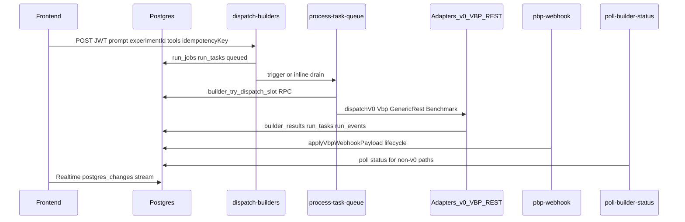

# Audyt hardeningowy — pipeline builderów (v0 + POP/VBP)

**Data:** 2026-03-23  
**Zakres:** full-stack (Edge Functions, DB/RPC, frontend realtime/stream, kontrakty POP/VBP).  
**Źródło prawdy implementacji:** [`supabase/functions/`](../supabase/functions/), [`src/hooks/`](../src/hooks/), [`docs/VBP-SPEC.md`](./VBP-SPEC.md).

**Uwaga (zakres audytu):** Ten dokument jest **inwentaryzacją, macierzami ryzyk, raportem driftu i planem slice’ów** (A–D) z opisem testów i rollbacku per slice. **Nie wdraża sam w sobie kodu** — implementacja slice’ów to **osobne PR-e**. Następny krok inżynierski: wybrać slice (np. **B** bezpieczeństwo webhooka + **A** terminale stanów kolejki) i zrobić implementację.

---

## 1. Mapa przepływu (inventory)

### Diagram end-to-end

### Ścieżki po typie integracji

| Adapter | Warunek (`resolveAdapterKind`) | Implementacja | Wynik |
|---------|-------------------------------|---------------|--------|
| `v0_live` | `toolId === "v0"` && tier 1 && enabled | [`v0-adapter.ts`](../supabase/functions/_shared/adapters/v0-adapter.ts) | v0 REST API |
| `vbp_live` | `integration_type === "vbp"`, tier ≤2, `api_base_url` | [`vbp-adapter.ts`](../supabase/functions/_shared/adapters/vbp-adapter.ts) | VBP dispatch + webhook/poll |
| `generic_rest_live` | `rest_api`, `api_base_url`, `response_id_path`, tier ≤2 | [`generic-rest-adapter.ts`](../supabase/functions/_shared/adapters/generic-rest-adapter.ts) | Szablony JSON |
| `benchmark` | disabled lub brak warunków | [`benchmark-adapter.ts`](../supabase/functions/_shared/adapters/benchmark-adapter.ts) | Mock / benchmark |

Źródło: [`adapter-registry.ts`](../supabase/functions/_shared/adapter-registry.ts).

### Auth i granice zaufania

| Komponent | Auth | Uwagi |
|-----------|------|--------|
| `dispatch-builders` | JWT użytkownika + ownership `experiments` | Idempotencja: `idempotency_key` per user → [`run_jobs`](./ORCHESTRATOR.md) |
| `process-task-queue` | Tylko Bearer = `SUPABASE_SERVICE_ROLE_KEY` | `verify_jwt=false`; brak JWT użytkownika |
| `pbp-webhook` | Opcjonalnie HMAC gdy `VBP_WEBHOOK_SECRET` | Bez sekretu — **każdy POST** (ryzyko produkcyjne) |
| `run-on-v0` | Anon | Goście; ryzyko abuse |
| `poll-v0-status` | Zwykle anon z przeglądarki | Zgodnie z `config.toml` |

### Rate limit i retry (backend)

| Mechanizm | Gdzie | Zachowanie |
|-----------|-------|------------|
| `builder_try_dispatch_slot` | RPC ([`20260325100000_builder_dispatch_slot_rpc.sql`](../supabase/migrations/20260325100000_builder_dispatch_slot_rpc.sql)) | `max_per_minute`, `max_concurrent` |
| Odrzucenie slotu | [`process-task-queue`](../supabase/functions/process-task-queue/index.ts) | `retrying`, `next_retry_at`, `attempt_count++`, backoff 60s / 15s |
| Circuit breaker | `builder_integration_config.circuit_state` | `retrying` + 60s, **brak** przejścia do benchmark |
| Brak max `attempt_count` | Worker | Teoretycznie nieskończone retry przy rate limit |

### Stream UI → tabele

| Hook / komponent | Tabele Realtime | Użycie |
|------------------|-----------------|--------|
| `useRunTaskStream` | `run_tasks`, `run_events`, `builder_results` | [`ComparisonCanvas`](../src/components/ComparisonCanvas.tsx) |
| `useBuilderApi.runBuilders` | `builder_results` channel + polling v0 | Po `dispatch-builders` |
| `RunCenter` | `run_events` | Feed zdarzeń |
| `RunsNow` | `experiments` INSERT | Live lista |

---

## 2. Macierz ryzyk — backend

| ID | Ryzyko | Severity | Dowód / plik | Mitigacja (właściciel: backend) |
|----|--------|----------|----------------|----------------------------------|
| B1 | Brak sufitu `attempt_count` → potencjalnie nieskończone `retrying` | **Wysoki** | [`process-task-queue/index.ts`](../supabase/functions/process-task-queue/index.ts) | Max attempts → `failed` lub `dead_letter`; migracja CHECK jeśli DB nie ma statusu |
| B2 | Frontend oczekuje `dead_letter` w typach; DB może nie mieć tego statusu | **Wysoki** | [`useRunTaskStream.ts`](../src/hooks/useRunTaskStream.ts), `BuilderProgressStream` | Ujednolicić enum `run_tasks.status` + worker |
| B3 | Webhook bez idempotencji (replay / kolejność) | **Wysoki** | [`vbp-webhook-apply.ts`](../supabase/functions/_shared/vbp-webhook-apply.ts) | Klucz idempotentny `(provider_run_id, event_hash, seq)` lub tabela dedupe |
| B4 | `VBP_WEBHOOK_SECRET` unset → brak weryfikacji | **Średni** | [`pbp-webhook/index.ts`](../supabase/functions/pbp-webhook/index.ts) | Produkcja: fail closed lub warn + blokada |
| B5 | `pickNextQueuedOrRetrying` bez `FOR UPDATE SKIP LOCKED` | **Średni** | Dwa równoległe worker invocation | Advisory lock lub atomic claim |
| B6 | Adaptery: v0 ma retry HTTP; VBP/generic REST — słabiej | **Niski** | [`v0-adapter.ts`](../supabase/functions/_shared/adapters/v0-adapter.ts) vs vbp | Ujednolicić retry na 429/5xx tam gdzie sensowne |
| B7 | Trigger kolejki z hardcoded URL (jeśli w migracji) | **Niski** | Starsze migracje | Parametryzacja / dokumentacja env |
| B8 | `run-on-v0` publiczny | **Średni** (koszt) | [`config.toml`](../supabase/config.toml) | Rate limit / captcha / quota |

---

## 3. Macierz ryzyk — frontend (stream / realtime)

| ID | Ryzyko | Severity | Dowód | Mitigacja (właściciel: frontend) |
|----|--------|----------|-------|-----------------------------------|
| F1 | Race: `loadInitialData` vs realtime może nadpisać świeższe eventy | **Wysoki** | [`useRunTaskStream.ts`](../src/hooks/useRunTaskStream.ts) L55–89 vs L105+ | Merge po `updated_at` / functional updates; lub load przed subscribe z cancel |
| F2 | Brak obsługi statusu kanału (`CHANNEL_ERROR`, reconnect) | **Średni** | `.subscribe()` bez callback | `subscribe((s)=>…)`, toast, reconnect |
| F3 | `run_tasks` handler tylko `payload.new` — DELETE nie czyści stanu | **Średni** | L111–118 | Obsłużyć DELETE z `payload.old` |
| F4 | Dwa źródła: `builderResults` vs `stream.results` — które nowsze | **Średni** | [`ComparisonCanvas`](../src/components/ComparisonCanvas.tsx) | Merge po timestamp; jedno źródło pierwszeństwa |
| F5 | `setResults` wywołuje `startV0Polling` wewnątrz updaters | **Średni** | [`useBuilderApi.ts`](../src/hooks/useBuilderApi.ts) L468+ | Przenieść do `useEffect` |
| F6 | Cichy fallback gościa gdy `createExperimentInDb` fail | **Wysoki** | [`Index.tsx`](../src/pages/Index.tsx) + experiment-service | Toast + stop albo retry |
| F7 | Brak retry na `dispatch-builders` invoke | **Średni** | [`useBuilderApi.ts`](../src/hooks/useBuilderApi.ts) L413+ | Retry z backoff na sieć/5xx |
| F8 | `RunCenter` duplikaty eventów bez dedupe po `id` | **Niski** | Por. `useRunTaskStream` INSERT dedupe | Dedupe jak w stream |

---

## 4. Raport driftu kontraktów (POP/VBP + v0)

### Single source of truth (rekomendacja)

1. **Normatywne opisy:** [`docs/VBP-SPEC.md`](./VBP-SPEC.md) + [`WEBHOOK-PAYLOAD-CONTRACT.md`](./WEBHOOK-PAYLOAD-CONTRACT.md).  
2. **JSON Schema:** [`docs/vbp-schemas/`](../docs/vbp-schemas/) (duplikat w `protocol/.../schemas/` — utrzymywać zsynchron lub skrypt sync).  
3. **Implementacja:** Edge adapters + `pbp-webhook` muszą być aktualizowane **razem** ze spec.

### Znany drift (do naprawy w Slice D)

| Temat | Dokument / schema | Kod | Problem |
|-------|-------------------|-----|---------|
| Nagłówek webhook | `X-VBP-Signature` w [VBP-SPEC.md](./VBP-SPEC.md) L74 | `x-pbp-signature` w [pbp-webhook](../supabase/functions/pbp-webhook/index.ts) | Partnerzy mogą wysłać zły header |
| OpenAPI `$ref` | [vbp-v1.openapi.yaml](../protocol/vibecoding-broker-protocol/openapi/vbp-v1.openapi.yaml) | L21 `../schemas/`, L28 `./schemas/` | Niespójne ścieżki względem katalogu `openapi/` |
| `webhook_url` required | [dispatch-request.json](../docs/vbp-schemas/dispatch-request.json) | VBP-SPEC: optional przy SSE | Niespójność z prose |
| Przykład Developer Portal | `/docs` UI | Kontrakt dispatch `{ broker_id, run_id, prompt, webhook_url }` | Zweryfikować [DeveloperPortal.tsx](../src/pages/DeveloperPortal.tsx) vs VBP |
| v0 API | Brak formalnego OpenAPI w repo | Impl w [v0-adapter.ts](../supabase/functions/_shared/adapters/v0-adapter.ts) | Uzupełnić „implicit contract” w docs |

---

## 5. Hardening slices (wdrożenie + testy + rollback)

### Slice A — Kolejka i terminale stanów

- **Cel:** max attempts, terminal `failed` / zgodny `dead_letter`, spójność z CHECK w DB.  
- **Testy:** integracja `process-task-queue` z mockiem RPC rate limit; unit status transitions.  
- **Rollback:** migracja revert + deploy poprzedniej wersji funkcji; feature flag jeśli dodany.

### Slice B — Webhook security i idempotencja

- **Cel:** jeden nagłówek (alias obu nazw w odbiorniku), dedupe eventów, prod wymaga sekretu.  
- **Testy:** replay tego samego body; kolejność zdarzeń; signature invalid → 401.  
- **Rollback:** wyłączenie strict mode env; revert apply logic.

### Slice C — Frontend stream

- **Cel:** merge bezpieczny load+realtime, status kanału, DELETE tasks, dispatch retry.  
- **Testy:** vitest hook z mockiem supabase; e2e smoke compare.  
- **Rollback:** revert commit hooków; UI dalej działa na polling-only jeśli dodany fallback.

### Slice D — Docs / CI / OpenAPI

- **Cel:** naprawa `$ref`, tabela aliasów nagłówków w VBP-SPEC, sync schema, CI validate against JSON Schema.  
- **Testy:** workflow `vbp-protocol.yml` rozszerzony; `vbp-validate` na przykładowym URL.  
- **Rollback:** docs-only, niski ryzyko.

**Kolejność zalecana:** B (security) częściowo równolegle z A (data integrity) → C → D.

**Status implementacji:** Opisy w §5 to **plan prac**; włączenie zmian w repozytorium następuje **dopiero w PR-ach slice’owych** (migracje, Edge, frontend według wybranego slice’a).

---

## 6. Checklist rollout — Lovable Cloud

Użyj po merge do `main` i przed pełnym trust na produkcji — **po** wdrożeniu zmian z wybranego slice’a (nie wymaga tego sam dokument audytu).

- [ ] **Git:** Lovable Sync / Pull = ten sam commit co `origin/main`.  
- [ ] **Migracje:** jeśli Slice A wprowadza nową migrację — uruchom na cloud Supabase (Lovable); sprawdź `run_tasks` CHECK.  
- [ ] **Edge Functions deploy:** `dispatch-builders`, `process-task-queue`, `pbp-webhook` (+ inne zmienione w releasie).  
- [ ] **Secrets:** `VBP_WEBHOOK_SECRET` ustawiony w prod jeśli webhook publiczny; `SUPABASE_SERVICE_ROLE_KEY`, `V0_API_KEY`, CORS `EDGE_ALLOWED_ORIGINS`.  
- [ ] **Smoke:** użytkownik zalogowany → dispatch wielu builderów → `run_tasks` nie zostają w `queued` (kolejka + inline fallback).  
- [ ] **Obserwowalność:** logi Edge / `run_events` / [`QUEUE-OBSERVABILITY.md`](./QUEUE-OBSERVABILITY.md).  

Powiązane: [`UI-PARITY-LOVABLE-SYNC.md`](./UI-PARITY-LOVABLE-SYNC.md), [`DEVELOPMENT-STATUS.md`](./DEVELOPMENT-STATUS.md), [`ORCHESTRATOR.md`](./ORCHESTRATOR.md).

---

## Kryteria ukończenia audytu (deliverables dokumentu)

- [x] Mapa przepływu prompt → queue → adapter → stream → wynik.  
- [x] Macierz ryzyk backend + frontend z severity i ścieżką naprawy.  
- [x] Raport driftu kontraktów + rekomendacja single source of truth.  
- [x] Plan slice’ów A–D (zakres, testy, rollback) — §5; **nie mylić z merge’em kodu.**  
- [x] Checklist Lovable Cloud (§6) — do użycia **po** wdrożeniu zmian z wybranego slice’a.

**Poza zakresem samego audytu (następne PR-e):** implementacja kodu dla slice’ów A–D — wybrać pierwszy slice (np. B + A, zgodnie z §5) i zrealizować w osobnych merge’ach.
