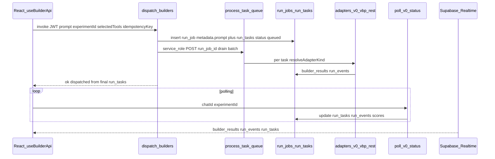

# Orchestrator (broker MVP)

Product verification: [PM-RUN-CHECKLIST.md](./PM-RUN-CHECKLIST.md). Queue health: [QUEUE-OBSERVABILITY.md](./QUEUE-OBSERVABILITY.md). Short intro (guest vs signed-in, v0 vs others): [BUILDERS-101.md](./BUILDERS-101.md). **Pipeline hardening audit (risk matrices, VBP drift, slices):** [BUILDER-PIPELINE-HARDENING-AUDIT.md](./BUILDER-PIPELINE-HARDENING-AUDIT.md).

## Flow

If `process-task-queue` is unreachable, `dispatch-builders` falls back to **inline** adapter execution for any remaining `queued` tasks.

## Tables (Postgres)

| Table | Role |
|-------|------|
| `run_jobs` | One dispatch batch per call; `idempotency_key` (per user), `trace_id`, `workflow_engine` (default `supabase_edge`). |
| `run_tasks` | One row per selected builder; status machine (`queued` → `dispatched` → `building` → `artifact_ready` → `scored` → `completed`, or `failed` / `benchmark`); opcjonalnie `next_retry_at` dla retry po rate limit (migracja `20260322120000_vbp_orchestration.sql`). |
| `run_events` | Append-only log; optional `run_job_id`, `run_task_id`; Realtime for Run Center. |
| `builder_results` | UI-facing row per `(experiment_id, tool_id)`; `provider_run_id`, `provenance`, `run_task_id`. |
| `builder_integration_config` | Per-tool `tier`, `enabled`, polling hints, VBP/REST fields; `circuit_state` dla breaker (ta sama migracja). Dodatkowo: `display_name`, `last_heartbeat` (poll/webhook), `config_validation_errors` + RPC `validate_builder_integration_config` (admin), trigger blokuje `enabled` przy brakach w VBP/REST (tier 1–2). |
| `broker_pool_accounts` / `broker_account_leases` | Audit trail for broker v0 usage. |
| `credit_transactions` | Debit on first live dispatch of an experiment (with subscription limits). |
| `referral_clicks` / `referral_conversions` | Handoff attribution from Compare CTA. |

## Code map

- Entry: [`supabase/functions/dispatch-builders/index.ts`](../supabase/functions/dispatch-builders/index.ts) — auth, idempotency, billing, enqueue `run_tasks`, drain via [`process-task-queue`](../supabase/functions/process-task-queue/index.ts) + inline fallback.
- Registry: [`supabase/functions/_shared/adapter-registry.ts`](../supabase/functions/_shared/adapter-registry.ts) — `v0_live`, `vbp_live`, `generic_rest_live`, `benchmark`.
- Adapters: [`v0-adapter.ts`](../supabase/functions/_shared/adapters/v0-adapter.ts), [`vbp-adapter.ts`](../supabase/functions/_shared/adapters/vbp-adapter.ts), [`generic-rest-adapter.ts`](../supabase/functions/_shared/adapters/generic-rest-adapter.ts), [`benchmark-adapter.ts`](../supabase/functions/_shared/adapters/benchmark-adapter.ts).
- VBP webhook: [`pbp-webhook`](../supabase/functions/pbp-webhook/index.ts) (builder → broker push).
- RAG crawl: [`rag-crawl-builder`](../supabase/functions/rag-crawl-builder/index.ts).
- Spec: [`VBP-SPEC.md`](./VBP-SPEC.md).
- Poll + baseline scores: [`supabase/functions/poll-v0-status/index.ts`](../supabase/functions/poll-v0-status/index.ts).
- Front: [`src/hooks/useBuilderApi.ts`](../src/hooks/useBuilderApi.ts), [`src/components/RunCenter.tsx`](../src/components/RunCenter.tsx).

## Idempotency

Same `idempotencyKey` + same user returns stored `dispatched` snapshot without re-charging subscription (see `run_jobs` unique partial index).

## Related docs

- [WORKFLOW-ENGINE.md](./WORKFLOW-ENGINE.md) — Temporal bridge, retries.
- [BYOA-MIGRATION.md](./BYOA-MIGRATION.md), [VERCEL-SUPABASE-MIGRATION.md](./VERCEL-SUPABASE-MIGRATION.md).
- [PVI-ORCHESTRATION-MAP.md](./PVI-ORCHESTRATION-MAP.md) — mapping PVI dimensions to the pipeline (AG / product benchmark).
- [REALTIME-GUARDRAILS.md](./REALTIME-GUARDRAILS.md) — Realtime channels, throttle, score off-path.
