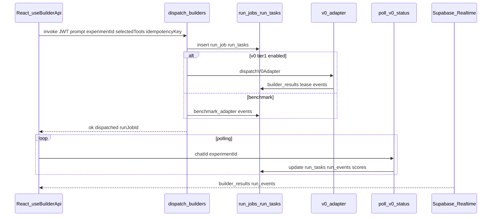

# Orchestrator (broker MVP)

## Flow

## Tables (Postgres)

| Table | Role |
|-------|------|
| `run_jobs` | One dispatch batch per call; `idempotency_key` (per user), `trace_id`, `workflow_engine` (default `supabase_edge`). |
| `run_tasks` | One row per selected builder; status machine (`queued` → `dispatched` → `building` → `artifact_ready` → `scored` → `completed`, or `failed` / `benchmark`). |
| `run_events` | Append-only log; optional `run_job_id`, `run_task_id`; Realtime for Run Center. |
| `builder_results` | UI-facing row per `(experiment_id, tool_id)`; `provider_run_id`, `provenance`, `run_task_id`. |
| `builder_integration_config` | Per-tool `tier`, `enabled`, polling hints. |
| `broker_pool_accounts` / `broker_account_leases` | Audit trail for broker v0 usage. |
| `credit_transactions` | Debit on first live dispatch of an experiment (with subscription limits). |
| `referral_clicks` / `referral_conversions` | Handoff attribution from Compare CTA. |

## Code map

- Entry: [`supabase/functions/dispatch-builders/index.ts`](../supabase/functions/dispatch-builders/index.ts) — auth, idempotency, billing, loop `resolveAdapterKind` → adapter.
- Registry: [`supabase/functions/_shared/adapter-registry.ts`](../supabase/functions/_shared/adapter-registry.ts) — extend with new `*_live` kinds when enabling Tier 1 for other tools.
- Adapters: [`supabase/functions/_shared/adapters/v0-adapter.ts`](../supabase/functions/_shared/adapters/v0-adapter.ts), [`benchmark-adapter.ts`](../supabase/functions/_shared/adapters/benchmark-adapter.ts).
- Poll + baseline scores: [`supabase/functions/poll-v0-status/index.ts`](../supabase/functions/poll-v0-status/index.ts).
- Front: [`src/hooks/useBuilderApi.ts`](../src/hooks/useBuilderApi.ts), [`src/components/RunCenter.tsx`](../src/components/RunCenter.tsx).

## Idempotency

Same `idempotencyKey` + same user returns stored `dispatched` snapshot without re-charging subscription (see `run_jobs` unique partial index).

## Related docs

- [WORKFLOW-ENGINE.md](./WORKFLOW-ENGINE.md) — Temporal bridge, retries.
- [BYOA-MIGRATION.md](./BYOA-MIGRATION.md), [VERCEL-SUPABASE-MIGRATION.md](./VERCEL-SUPABASE-MIGRATION.md).
