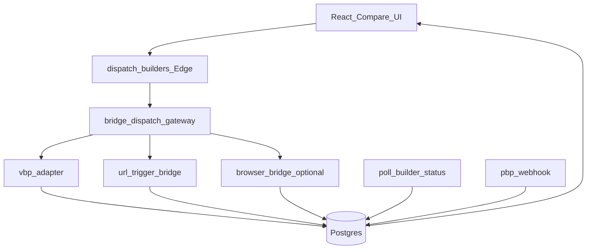

# VBP Bridge Mode — architecture (implementation plan)

Goal: **normalize** different builder surfaces (URL, partial API, future browser worker) into existing orchestrator tables: `run_jobs`, `run_tasks`, `builder_results`, `run_events`.  
Orchestrator source of truth: [ORCHESTRATOR.md](./ORCHESTRATOR.md).

## Logical components

| Component | Role |
|-----------|------|
| **bridge-dispatch-gateway** | Maps user request (prompt, toolId) to an action: native VBP adapter, URL handoff, or (optional) job to a browser worker. |
| **bridge-status-normalizer** | Translates partner responses (JSON poll, event webhook, future SSE proxy) into `run_tasks` statuses and `builder_results` rows. |
| **bridge-risk-guard** | Checks `allowed_bridge_mode` per `tool_id`, limits, circuit breaker (`builder_integration_config`), [POP-BRIDGE-RISK-POLICY.md](./POP-BRIDGE-RISK-POLICY.md). |
| **bridge-attribution** | UTM / `ref` / logging `referral_clicks` and `referral_conversions` ([POP-ROI-METRICS.md](./POP-ROI-METRICS.md)). |

## Flow (high level)

**Note:** `bridge-dispatch-gateway` can initially be **conditional logic** in `dispatch-builders` / `adapter-registry` instead of a separate deploy — conceptual separation and tests matter.

## Feature flags (frontend)

Controlled in [featureFlags.ts](../src/lib/featureFlags.ts):

| Variable | Default | Meaning |
|----------|---------|---------|
| `VITE_FF_BRIDGE_MODE` | `false` (off) | Enables bridge paths (URL / future adapters) in UI and backend. |
| `VITE_FF_BRIDGE_AGGRESSIVE` | `false` (off) | Enables high-risk bridges (e.g. RPA); requires `BRIDGE_MODE` and consent from [POP-BRIDGE-RISK-POLICY.md](./POP-BRIDGE-RISK-POLICY.md). |

## Per-builder configuration

Extension of `builder_integration_config` (future) or separate `bridge_config` table:

- `allowed_bridge_mode`: `api_native` | `api_partial` | `browser_only` | `off`
- `url_template` — for Lovable-style “build with URL”
- `max_concurrent_bridges` — concurrency caps

Until migration: [POP-BRIDGE-REGISTRY.md](./POP-BRIDGE-REGISTRY.md) as documentation + manual flags.

## Attribution

- On CTA “Open in builder”: `logReferralClick` / `logReferralHandoff` in [experiment-service.ts](../src/lib/experiment-service.ts).
- `ref` / UTM parameters on partner URL per commercial agreement.

## Related

- [POP-BRIDGE-RUNBOOK.md](./POP-BRIDGE-RUNBOOK.md)
- [POP-BRIDGE-REGISTRY.md](./POP-BRIDGE-REGISTRY.md)
