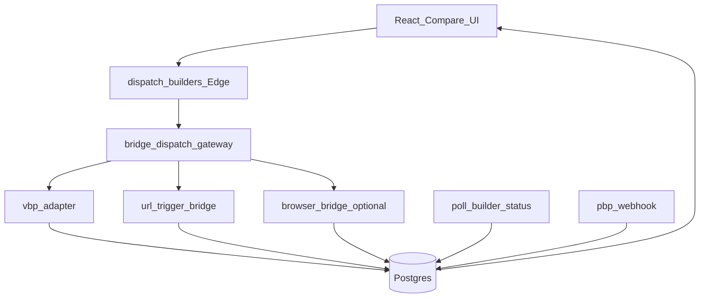

# POP Bridge Mode — architektura (plan implementacji)

Cel: **normalizacja** różnych powierzchni buildera (URL, częściowe API, przyszły browser worker) do istniejących tabel orchestratora: `run_jobs`, `run_tasks`, `builder_results`, `run_events`.  
Źródło prawdy orchestratora: [ORCHESTRATOR.md](./ORCHESTRATOR.md).

## Komponenty logiczne

| Komponent | Rola |
|-----------|------|
| **bridge-dispatch-gateway** | Mapuje żądanie użytkownika (prompt, toolId) na konkretną akcję: natywny adapter VBP, URL handoff, lub (opcjonalnie) job do workera przeglądarkowego. |
| **bridge-status-normalizer** | Tłumaczy odpowiedzi partnela (JSON poll, event webhook, przyszły SSE proxy) na statusy `run_tasks` i wiersze `builder_results`. |
| **bridge-risk-guard** | Sprawdza `allowed_bridge_mode` per `tool_id`, limity, circuit breaker (`builder_integration_config`), politykę [POP-BRIDGE-RISK-POLICY.md](./POP-BRIDGE-RISK-POLICY.md). |
| **bridge-attribution** | UTM / `ref` / logowanie `referral_clicks` i `referral_conversions` ([POP-ROI-METRICS.md](./POP-ROI-METRICS.md)). |

## Przepływ (wysoki poziom)

**Uwaga:** `bridge-dispatch-gateway` może początkowo być **logiką warunkową** w `dispatch-builders` / `adapter-registry` zamiast osobnego deployu — ważna jest separacja koncepcyjna i testy.

## Feature flags (frontend)

Sterowane w [featureFlags.ts](../src/lib/featureFlags.ts):

| Zmienna | Domyślnie | Znaczenie |
|---------|-----------|-----------|
| `VITE_FF_BRIDGE_MODE` | `false` (off) | Włącza ścieżki mostów (URL / przyszłe adaptery) w UI i backendzie. |
| `VITE_FF_BRIDGE_AGGRESSIVE` | `false` (off) | Włącza mosty wysokiego ryzyka (np. RPA); wymaga `BRIDGE_MODE` i zgody z [POP-BRIDGE-RISK-POLICY.md](./POP-BRIDGE-RISK-POLICY.md). |

## Konfiguracja per builder

Rozszerzenie `builder_integration_config` (przyszłość) lub osobna tabela `bridge_config`:

- `allowed_bridge_mode`: `api_native` | `api_partial` | `browser_only` | `off`
- `url_template` — dla Lovable-style Build-with-URL
- `max_concurrent_bridges` — limity równoległości

Do czasu migracji: [POP-BRIDGE-REGISTRY.md](./POP-BRIDGE-REGISTRY.md) jako dokumentacja + ręczne flagi.

## Attribution

- Przy CTA „Open in builder”: `logReferralClick` / `logReferralHandoff` w [experiment-service.ts](../src/lib/experiment-service.ts).
- Parametry `ref` / UTM w URL partnera zgodnie z ustaleniami komercyjnymi.

## Powiązane

- [POP-BRIDGE-RUNBOOK.md](./POP-BRIDGE-RUNBOOK.md)
- [POP-BRIDGE-REGISTRY.md](./POP-BRIDGE-REGISTRY.md)
